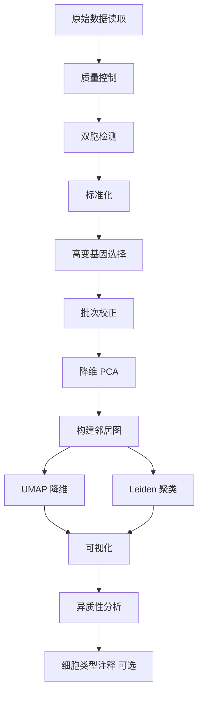

# Single Cell RNA-seq Analysis Pipeline

[](https://www.python.org/downloads/)
[](https://opensource.org/licenses/MIT)
[](https://github.com/thesecondfox/sc-rna-pipeline/stargazers)
[](https://github.com/thesecondfox/sc-rna-pipeline/issues)
[](https://github.com/psf/black)

一个完整的单细胞RNA测序数据分析流程，支持从原始数据读取到质控、整合、降维、聚类和细胞类型注释的全流程分析。

[English](README_EN.md) | 简体中文

## ✨ 特性

- 🔬 **完整流程**: 从原始数据到细胞类型注释的一站式分析
- 📊 **质量控制**: 自动化的质控和双胞检测（Scrublet）
- 🔄 **批次校正**: 支持 Harmony 和 Combat 等多种整合方法
- 🎨 **可视化**: 自动生成 UMAP 图和异质性分析图
- 💾 **数据保留**: 每一步都正确保留 `.raw` 属性，方便后续分析
- 🚀 **高性能**: 支持 HPC 集群任务提交
- 📈 **异质性分析**: 自动计算和可视化不同分组的细胞异质性

## 📋 目录

- [安装](#安装)
- [快速开始](#快速开始)
- [使用方法](#使用方法)
- [参数说明](#参数说明)
- [输出文件](#输出文件)
- [示例](#示例)
- [文档](#文档)
- [常见问题](#常见问题)
- [引用](#引用)
- [许可证](#许可证)

## 🔧 安装

### 依赖要求

- Python >= 3.8
- scanpy >= 1.9.0
- anndata >= 0.8.0
- pandas >= 1.3.0
- numpy >= 1.20.0
- scipy >= 1.7.0
- scrublet >= 0.2.3
- harmonypy >= 0.0.6 (可选，用于 Harmony 整合)
- celltypist >= 1.3.0 (可选，用于细胞类型注释)

### 方法 1: 使用 conda（推荐）
```bash
# 克隆仓库
git clone https://github.com/thesecondfox/sc-rna-pipeline.git
cd sc-rna-pipeline

# 创建 conda 环境
conda create -n sc-pipeline python=3.8
conda activate sc-pipeline

# 安装依赖
pip install -r requirements.txt
```

### 方法 2: 使用 pip
```bash
git clone https://github.com/thesecondfox/sc-rna-pipeline.git
cd sc-rna-pipeline
pip install -r requirements.txt
```

### 方法 3: 直接安装（开发中）
```bash
pip install sc-rna-pipeline
```

详细安装说明请参考 [安装文档](docs/installation.md)

## 🚀 快速开始

### 1. 准备样品信息文件

创建一个 CSV 文件（例如 `samples.csv`），包含以下列：
```csv
Path,SampleName,Group,Stage,Region
/path/to/sample1,Sample1,Control,Adult,Colon
/path/to/sample2,Sample2,Treatment,Adult,Colon
/path/to/sample3,Sample3,Control,Fetal,Ileum
```

**必需列**:
- `Path`: 包含 `matrix.mtx`, `barcodes.tsv`, `features.tsv` 的目录路径
- `SampleName`: 样品唯一标识符

**可选列**: 其他任何元数据列（如 Group, Stage, Region 等）都会被保留

### 2. 运行分析
```bash
python sc_pipeline.py \
    --sample_info samples.csv \
    --output_dir ./results \
    --min_genes 200 \
    --max_genes 6000 \
    --max_pct_mito 20 \
    --integration_method harmony
```

### 3. HPC 集群任务提交

如果使用 LSF 或类似的作业调度系统：
```bash
# 编辑 submit_job.sh 配置
vim submit_job.sh

# 提交任务
chmod +x submit_job.sh
./submit_job.sh
```

## 📖 使用方法

### 基础用法
```bash
python sc_pipeline.py --sample_info <CSV_FILE> --output_dir <OUTPUT_DIR>
```

### 完整参数示例
```bash
python sc_pipeline.py \
    --sample_info samples.csv \
    --output_dir ./results \
    --min_genes 200 \
    --max_genes 6000 \
    --max_pct_mito 20 \
    --doublet_method scrublet \
    --doublet_threshold 0.25 \
    --integration_method harmony \
    --n_pcs 30 \
    --n_neighbors 10 \
    --resolution 1.1 \
    --gene_num 2000 \
    --umap_min_dist 0.5
```

### 包含细胞类型注释
```bash
python sc_pipeline.py \
    --sample_info samples.csv \
    --output_dir ./results \
    --run_annotation \
    --celltypist_model /path/to/model.pkl
```

更多使用方法请参考 [使用文档](docs/usage.md)

## ⚙️ 参数说明

### 必需参数

| 参数 | 说明 |
|------|------|
| `--sample_info` | 样品信息 CSV 文件路径 |

### 质控参数

| 参数 | 默认值 | 说明 |
|------|--------|------|
| `--min_genes` | 200 | 每个细胞的最低基因数 |
| `--max_genes` | 6000 | 每个细胞的最高基因数 |
| `--max_pct_mito` | 20.0 | 线粒体基因百分比阈值 |
| `--doublet_method` | scrublet | 双胞检测方法 (scrublet/none) |
| `--doublet_threshold` | 0.25 | 双胞检测阈值 |

### 整合参数

| 参数 | 默认值 | 说明 |
|------|--------|------|
| `--integration_method` | harmony | 批次校正方法 (harmony/combat/none) |
| `--n_pcs` | 30 | 主成分数量 |
| `--n_neighbors` | 10 | KNN 图的邻居数量 |
| `--resolution` | 1.1 | Leiden 聚类分辨率 |
| `--gene_num` | 2000 | 高变基因数量 |
| `--umap_min_dist` | 0.5 | UMAP 最小距离参数 |

### 注释参数

| 参数 | 默认值 | 说明 |
|------|--------|------|
| `--run_annotation` | False | 是否运行细胞类型注释 |
| `--celltypist_model` | None | CellTypist 模型路径 |

### 输出参数

| 参数 | 默认值 | 说明 |
|------|--------|------|
| `--output_dir` | ./results | 输出目录 |

## 📁 输出文件

运行完成后，`output_dir` 中会生成以下文件：
```
results/
├── raw_data.h5ad                    # 原始数据
├── filtered_data.h5ad               # 质控后数据（.raw 包含原始 counts）
├── integrated_data.h5ad             # 整合后数据（.raw 包含完整基因集）
├── qc_statistics.csv                # 质控统计表
├── heterogeneity_stats.csv          # 异质性统计表
├── umap_leiden.png                  # Leiden 聚类 UMAP 图
├── umap_SampleName.png              # 样品分布 UMAP 图
├── umap_<group>.png                 # 各分组的 UMAP 图
├── heterogeneity_<group>.png        # 各分组的异质性分析图
└── annotated_data.h5ad             # 细胞类型注释结果（可选）
```

### 关于 .raw 属性

- `filtered_data.h5ad`: `.raw` 包含**原始 counts**（未标准化），`.X` 包含标准化数据
- `integrated_data.h5ad`: `.raw` 包含**完整基因集**的标准化数据，`.X` 包含高变基因

这样设计可以方便后续的差异表达分析和可视化。

## 💡 示例

### 示例 1: 基础分析流程
```bash
python sc_pipeline.py \
    --sample_info example/samples.csv \
    --output_dir ./my_results
```

### 示例 2: 自定义质控参数
```bash
python sc_pipeline.py \
    --sample_info samples.csv \
    --output_dir ./results \
    --min_genes 500 \
    --max_genes 8000 \
    --max_pct_mito 15
```

### 示例 3: 使用 Combat 整合
```bash
python sc_pipeline.py \
    --sample_info samples.csv \
    --output_dir ./results \
    --integration_method combat
```

### 示例 4: 完整分析（包括注释）
```bash
python sc_pipeline.py \
    --sample_info samples.csv \
    --output_dir ./results \
    --integration_method harmony \
    --run_annotation \
    --celltypist_model models/Immune_All_Low.pkl
```

### 示例 5: 读取结果进行下游分析
```python
import scanpy as sc

# 读取整合后的数据
adata = sc.read_h5ad("results/integrated_data.h5ad")

# 访问高变基因的表达矩阵
print(adata.X.shape)  # (n_cells, n_hvgs)

# 访问完整基因集的表达矩阵
print(adata.raw.X.shape)  # (n_cells, n_all_genes)

# 差异表达分析（使用完整基因集）
sc.tl.rank_genes_groups(adata, 'leiden', method='wilcoxon')

# 可视化特定基因（会自动使用 .raw 中的数据）
sc.pl.umap(adata, color=['CD3D', 'CD8A', 'leiden'])
```

更多示例请参考 [教程文档](docs/tutorial.md)

## 📚 文档

- [安装指南](docs/installation.md)
- [使用说明](docs/usage.md)
- [完整教程](docs/tutorial.md)
- [常见问题](docs/faq.md)

## ❓ 常见问题

<details>
<summary><b>Q: 如何处理 10X Genomics 数据？</b></summary>

本流程自动兼容 10X Genomics 输出格式。只需确保数据目录包含：
- `matrix.mtx` 或 `matrix.mtx.gz`
- `barcodes.tsv` 或 `barcodes.tsv.gz`
- `features.tsv` 或 `features.tsv.gz`（或 `genes.tsv`）

</details>

<details>
<summary><b>Q: 内存不足怎么办？</b></summary>

1. 减少 `--gene_num` 参数（默认 2000）
2. 增加质控阈值，过滤更多低质量细胞
3. 分批处理样品
4. 使用更大内存的计算节点

</details>

<details>
<summary><b>Q: Harmony 整合失败？</b></summary>

确保安装了 harmonypy：
```bash
pip install harmonypy
```

如果仍然失败，可以尝试使用 Combat：
```bash
--integration_method combat
```

</details>

<details>
<summary><b>Q: 如何选择聚类分辨率？</b></summary>

`--resolution` 参数控制聚类粗细：
- 较小的值（0.5-0.8）：较少、较大的 cluster
- 中等的值（1.0-1.5）：适中的 cluster 数量
- 较大的值（2.0+）：更多、更细的 cluster

建议先用默认值 1.1，然后根据结果调整。

</details>

<details>
<summary><b>Q: .raw 属性有什么用？</b></summary>

`.raw` 保存了完整的基因集，用于：
1. 差异表达分析（需要所有基因）
2. 基因表达可视化（可能包含非高变基因）
3. 后续的重新分析

`.X` 只包含高变基因，用于降维和聚类，可以提高计算效率。

</details>

更多问题请查看 [FAQ 文档](docs/faq.md)

## 🔬 工作流程


## 🤝 贡献

欢迎提交 Issue 和 Pull Request！

### 如何贡献

1. Fork 本仓库
2. 创建你的特性分支 (`git checkout -b feature/AmazingFeature`)
3. 提交你的更改 (`git commit -m 'Add some AmazingFeature'`)
4. 推送到分支 (`git push origin feature/AmazingFeature`)
5. 打开一个 Pull Request

### 贡献者行为准则

请遵守我们的 [贡献者行为准则](CODE_OF_CONDUCT.md)

## 📚 引用

如果您在研究中使用了本流程，请引用以下工具：
```bibtex
@misc{thesecondfox2025scrna,
  author = {thesecondfox},
  title = {Single Cell RNA-seq Analysis Pipeline},
  year = {2025},
  publisher = {GitHub},
  url = {https://github.com/thesecondfox/sc-rna-pipeline}
}

@article{wolf2018scanpy,
  title={SCANPY: large-scale single-cell gene expression data analysis},
  author={Wolf, F Alexander and Angerer, Philipp and Theis, Fabian J},
  journal={Genome biology},
  volume={19},
  number={1},
  pages={1--5},
  year={2018}
}

@article{korsunsky2019harmony,
  title={Fast, sensitive and accurate integration of single-cell data with Harmony},
  author={Korsunsky, Ilya and Millard, Nghia and Fan, Jean and others},
  journal={Nature methods},
  volume={16},
  number={12},
  pages={1289--1296},
  year={2019}
}

@article{wolock2019scrublet,
  title={Scrublet: computational identification of cell doublets in single-cell transcriptomic data},
  author={Wolock, Samuel L and Lopez, Romain and Klein, Allon M},
  journal={Cell systems},
  volume={8},
  number={4},
  pages={281--291},
  year={2019}
}
```

## 📊 统计


## 📄 许可证

本项目采用 MIT 许可证 - 查看 [LICENSE](LICENSE) 文件了解详情

## 👥 作者

- **thesecondfox** - [@thesecondfox](https://github.com/thesecondfox)

## 🙏 致谢

- [Scanpy](https://scanpy.readthedocs.io/) - 单细胞分析核心框架
- [Harmony](https://github.com/immunogenomics/harmony) - 批次效应校正
- [Scrublet](https://github.com/swolock/scrublet) - 双胞检测
- [CellTypist](https://github.com/Teichlab/celltypist) - 细胞类型注释
- 所有贡献者和用户

## 📞 联系方式

如有问题，请通过以下方式联系：
- 提交 Issue: https://github.com/thesecondfox/sc-rna-pipeline/issues
- GitHub: [@thesecondfox](https://github.com/thesecondfox)
- 讨论区: https://github.com/thesecondfox/sc-rna-pipeline/discussions

## 🌟 Star History

[](https://star-history.com/#thesecondfox/sc-rna-pipeline&Date)

---

⭐ 如果这个项目对您有帮助，请给我们一个 Star！

**注意**: 本项目仍在积极开发中，欢迎反馈和建议。
```

## 2. LICENSE
```
MIT License

Copyright (c) 2025 thesecondfox

Permission is hereby granted, free of charge, to any person obtaining a copy
of this software and associated documentation files (the "Software"), to deal
in the Software without restriction, including without limitation the rights
to use, copy, modify, merge, publish, distribute, sublicense, and/or sell
copies of the Software, and to permit persons to whom the Software is
furnished to do so, subject to the following conditions:

The above copyright notice and this permission notice shall be included in all
copies or substantial portions of the Software.

THE SOFTWARE IS PROVIDED "AS IS", WITHOUT WARRANTY OF ANY KIND, EXPRESS OR
IMPLIED, INCLUDING BUT NOT LIMITED TO THE WARRANTIES OF MERCHANTABILITY,
FITNESS FOR A PARTICULAR PURPOSE AND NONINFRINGEMENT. IN NO EVENT SHALL THE
AUTHORS OR COPYRIGHT HOLDERS BE LIABLE FOR ANY CLAIM, DAMAGES OR OTHER
LIABILITY, WHETHER IN AN ACTION OF CONTRACT, TORT OR OTHERWISE, ARISING FROM,
OUT OF OR IN CONNECTION WITH THE SOFTWARE OR THE USE OR OTHER DEALINGS IN THE
SOFTWARE.
